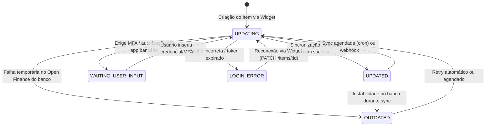

# Research: Integração Open Finance com Pluggy (R1)

> **Data da pesquisa**: 05 de outubro de 2026  
> **Autor**: Gemini (Deep Research)  
> **Alimenta as features**: `007 · conexao-open-finance`, `008 · sync-automatica`, `011 · deduplicacao`, `018 · faturas-cartao`  
> **Formato de entrega**: Conforme padronizado em `docs/gemini-handoff.md`

---

## 1. Resumo (5 linhas)

O modelo pessoal "Meu Pluggy" permite a usuários conectar contas em `meu.pluggy.ai` e integrá-las via conector de desenvolvedor, mas o limite exato de conexões e a viabilidade do widget direto `react-pluggy-connect` sem plano comercial **não são confirmados na documentação pública oficial**.
As 4 instituições do Doug (**Caixa, C6 Bank, Mercado Pago e PicPay**) possuem conectores ativos na plataforma, abrangendo contas, cartões e investimentos básicos.
Webhooks da Pluggy **não possuem assinatura HMAC nativa**, exigindo validação via cabeçalho customizado e allowlist do IP oficial `52.67.145.81`, notificando eventos como `transactions/created`, `updated` e `deleted`.
A API impõe limites de taxa estritos de **360 req/min por IP e por endpoint** (`POST /auth`, `GET /accounts`, `GET /transactions`, `GET /investments`) e **20 req/min em `PATCH /items`**, sendo este último o endpoint correto para re-sincronização.
A premissa de custo R$ 0 das features 007/008 depende de teste prático da conta dev pelo Doug antes de aprovar a spec 007.

---

## 2. Achados Detalhados

### 2.1 Modelo "Meu Pluggy" vs. API Comercial e Custos

| Critério                        | "Meu Pluggy" (Uso Pessoal / Desenvolvedor)                                                                                                                                                                                                                                                          | Planos Comerciais Pluggy                                                                             |
| ------------------------------- | --------------------------------------------------------------------------------------------------------------------------------------------------------------------------------------------------------------------------------------------------------------------------------------------------- | ---------------------------------------------------------------------------------------------------- |
| **Público-alvo**                | Uso próprio via portal `meu.pluggy.ai` / teste de desenvolvedor.                                                                                                                                                                                                                                    | Fintechs e apps corporativos com múltiplos usuários.                                                 |
| **Custo**                       | **R$ 0 / mês** (em modo de teste / desenvolvedor).                                                                                                                                                                                                                                                  | Relatos comunitários apontam a partir de **R$ 2.500 / mês** (preço sob consulta comercial; TabNews). |
| **Limite de Conexões**          | **Não confirmado oficialmente** (relatos de 5 conexões na comunidade; documentação do Actual Budget relata lista de conectores congelada após trial).                                                                                                                                               | Escalável conforme contrato comercial.                                                               |
| **Acesso à API**                | Consumo via conector "MeuPluggy" e credenciais de dashboard em sandbox/trial.                                                                                                                                                                                                                       | Acesso irrestrito a conectores diretos de todas as instituições e widget whitelabel.                 |
| **SLA & Suporte**               | Comunitário / sem garantia de disponibilidade.                                                                                                                                                                                                                                                      | Suporte técnico dedicado e SLA garantido.                                                            |
| **Impacto no Prumo (ADR 0003)** | **Atenção**: O widget direto `react-pluggy-connect` chamando endpoints de produção pode exigir plano comercial. Se o modo gratuito só funcionar via portal `meu.pluggy.ai`, o Doug precisará decidir na spec 007 entre validar esse conector, pagar plano ou priorizar importação manual (009/010). | Custo incompatível com o teto de R$ 0 do Prumo.                                                      |

### 2.2 Ambiente de Sandbox

- **Conector de Teste**: A Pluggy fornece um conector de Sandbox que simula instituições financeiras sem tocar em bancos reais.
- **Credenciais Mapeadas no Sandbox**:
  - `user-ok` / `password-ok` (MFA `123456`) $\rightarrow$ simula conexão bem-sucedida (`UPDATED`).
  - `user-error` $\rightarrow$ simula erro inesperado da instituição (`UNEXPECTED_ERROR`).
  - `user-account-need-actions` $\rightarrow$ simula necessidade de ação do usuário no banco (`ACCOUNT_NEEDS_ACTION`).
  - Qualquer outro usuário / credencial não mapeada $\rightarrow$ simula erro de credenciais/login inválido (`LOGIN_ERROR`).
- **Dinâmica dos Dados**: Dados de transações em Sandbox sofrem refresh semanal. Itens inativos há mais de 30 dias são excluídos automaticamente pela Pluggy.
- **Uso em CI**: Conforme Constitution V, o CI não deve chamar a API externa da Pluggy. Testes de integração utilizam fixtures baseadas nos contratos OpenAPI da Pluggy.

### 2.3 Cobertura dos Conectores do Perfil do Doug

| Instituição                 | Conector Pluggy       | Contas Suportadas                    | Cartão de Crédito / Faturas                           | Investimentos                               |
| --------------------------- | --------------------- | ------------------------------------ | ----------------------------------------------------- | ------------------------------------------- |
| **Caixa Econômica Federal** | `Caixa` / `Caixa Tem` | Conta corrente, poupança, Caixa Tem. | Sim (faturas e lançamentos).                          | Aplicações básicas / poupança.              |
| **C6 Bank**                 | `C6 Bank` (PF)        | Conta corrente.                      | Sim (faturas abertas/fechadas, lançamentos, limites). | CDBs e fundos C6.                           |
| **Mercado Pago**            | `Mercado Pago` (PF)   | Conta digital / carteira.            | Cartão de crédito Mercado Pago.                       | Saldo remunerado.                           |
| **PicPay**                  | `PicPay` (PF)         | Carteira digital / conta corrente.   | Cartão PicPay Card.                                   | Cofrinhos / Caixinhas (mapeados como CDBs). |

_Nota de estabilidade_: Conectores de bancos tradicionais (como Caixa) sofrem com maior frequência de janelas de manutenção de Open Finance aos finais de semana, exigindo tratamento adequado do estado `OUTDATED`.

### 2.4 Arquitetura do Widget Pluggy Connect em Next.js

Para respeitar a **Constitution II (Segredos apenas no servidor)**:

```text
[Navegador / React]              [Next.js Server API]              [Pluggy API]
        |                                 |                             |
        |--- 1. POST /api/pluggy/token -->|                             |
        |                                 |--- 2. Autentica com ------->|
        |                                 |    CLIENT_ID / SECRET       |
        |                                 |<-- 3. Retorna access token -|
        |                                 |                             |
        |                                 |--- 4. POST /connect_token ->|
        |                                 |<-- 5. connectToken (30 min)-|
        |<-- 6. { connectToken } ---------|                             |
        |                                                               |
        |--- 7. Monta <PluggyConnect connectToken={...} /> ------------>|
        |       (abre modal / iframe seguro do Open Finance)           |
        |                                                               |
        |<-- 8. onSuccess({ item }) / onError({ error }) ---------------|
        |                                 |                             |
        |--- 9. Notifica backend -------->|                             |
```

- **Frontend**: Utiliza a biblioteca oficial `react-pluggy-connect`.
- **Token**: O `connectToken` tem validade de **30 minutos** e escopo estritamente limitado à sessão do widget.
- **Modo Reconexão / Atualização**: Ao precisar atualizar credenciais de um item já existente, passa-se o `itemId` na criação do `connectToken` (`POST /connect_token { itemId: "..." }`). Isso evita duplicar itens no banco do Prumo.

### 2.5 Ciclo de Vida do Item e Máquina de Estados

Um `Item` representa a conexão com uma instituição financeira:



- **`UPDATING`**: Coleta de contas, faturas e transações em progresso.
- **`UPDATED`**: Conexão saudável; dados prontos para ingestão.
- **`WAITING_USER_INPUT`**: Exige intervenção do usuário (ex.: autenticação biométrica ou token SMS).
- **`LOGIN_ERROR`**: Conexão quebrada por alteração de senha ou expiração de chave. Requer abertura do widget em modo de reconexão.
- **`OUTDATED`**: Instabilidade temporária de rede ou indisponibilidade da instituição. Não requer nova senha de imediato; resolve-se com retentativa (backoff exponencial).

### 2.6 Consentimento e Expiração no Open Finance

- **Validade do Consentimento**: Por padrão na Pluggy, os consentimentos de Open Finance são solicitados sem data limite de expiração (`expiresAt: null`).
- **Exceções**: Certas instituições impõem teto regulatório de 12 meses.
- **Revogação**: O usuário pode revogar o acesso a qualquer momento pelo aplicativo do seu próprio banco. Nesse caso, a Pluggy passa a reportar erro de autorização.
- **Renovação**: É realizada chamando `PATCH /items/:id` e abrindo o widget com o mesmo `itemId`, preservando as chaves estrangeiras já associadas no banco do Prumo.

### 2.7 Webhooks, Limites de Taxa e Sincronização Automática

- **Eventos Oficiais Suportados**:
  - `item/created`: Item recém-conectado.
  - `item/updated`: Sincronização concluída com sucesso.
  - `item/error`: Falha durante atualização.
  - `item/deleted`: Conexão removida.
  - `item/waiting_user_input`: Exige ação do usuário (MFA).
  - `item/waiting_user_action`: Exige autorização ou ação do usuário no aplicativo do banco.
  - `item/login_succeeded`: Credenciais revalidadas com sucesso.
  - `connector/status_updated`: Mudança de disponibilidade na instituição financeira.
  - `transactions/created`: Novos lançamentos capturados.
  - `transactions/updated`: Lançamento modificado pelo banco (ex.: conciliação de data/descrição).
  - `transactions/deleted`: Lançamento estornado ou excluído (vital para Constitution IV).
- **Segurança e Validação de Webhook (Sem HMAC Nativo)**:
  - A Pluggy **não envia assinatura criptográfica HMAC por padrão**. A segurança do endpoint no Next.js (`/api/webhooks/pluggy`) depende de:
    1. Cadastro de cabeçalho secreto customizado (ex.: `x-webhook-secret: <token>`) validado em tempo constante (`crypto.timingSafeEqual`).
    2. **Allowlist de IP**: Restringir requisições estritamente ao endereço IP oficial de saída da Pluggy: **`52.67.145.81`**.
  - **Política de Retentativa de Webhook**: A Pluggy realiza até 3 retentativas automáticas com intervalos progressivos (backoff) caso o endpoint de destino responda com status diferente de 2xx ou sofra timeout.
- **Limites de Taxa (Rate Limits)**:
  - **360 requisições por minuto por IP e por endpoint** (especificamente nos endpoints `POST /auth`, `GET /accounts`, `GET /transactions` e `GET /investments`).
  - **20 requisições por minuto no endpoint `PATCH /items`** (utilizado para re-sincronização e atualização de credenciais).
- **Janela de Transações**:
  - Em implementações de Open Finance, a sincronização inicial busca tipicamente até 12 meses e sincronizações diárias buscam os últimos 7 dias. Porém, **esses intervalos não são garantidos de forma homogênea por contrato em todas as instituições**, variando conforme a estabilidade de cada banco.

---

## 3. Limitações e Riscos

1. **Incerteza do Modelo "Meu Pluggy" e Custo R$ 0**:
   - A documentação oficial não garante de forma perene o uso gratuito de conectores de produção via API/widget para pessoas físicas.
   - O Doug precisará realizar um teste empírico conectando suas credenciais de desenvolvedor para confirmar se o conector "MeuPluggy" permite sincronização contínua ou se expira após o período de testes.
2. **Volatilidade de APIs Bancárias**: Instituições bancárias (principalmente estatais como a Caixa) passam por janelas frequentes de manutenção de Open Finance aos finais de semana, exigindo que o sistema tolere o estado `OUTDATED` com retentativas agendadas.
3. **MFA e Intervenções Periódicas**: Algumas instituições exigem reconfirmação de token pelo aplicativo a cada poucas semanas. A Feature 008 (Sync Automática) deve detectar `item/waiting_user_input` e alertar o usuário sem travar os jobs em segundo plano.
4. **Duplicação com Importação Manual**: Como o Doug também fará importação de arquivos (PDF de fatura do C6 e extratos OFX), a Feature 011 (Deduplicação) precisará correlacionar o `external_id` da Pluggy com data, valor exato e descrição das importações manuais para evitar duplicar entradas.

---

## 4. Recomendações Técnicas para as Specs 007 e 008

1. **Conta e Chaves da Pluggy**:
   - Criar a conta de desenvolvedor no portal [pluggy.ai](https://pluggy.ai/) e verificar o comportamento da chave no conector MeuPluggy.
   - Armazenar `PLUGGY_CLIENT_ID` e `PLUGGY_CLIENT_SECRET` estritamente nas variáveis de ambiente do servidor Vercel (Production) e no `.env.local` de desenvolvimento.
2. **Isolamento de Segredos e API Route**:
   - Criar rota `src/app/api/pluggy/token/route.ts` que valida a sessão do usuário (Feature 006) e emite o `connectToken` com TTL de 30 minutos.
3. **Persistência de Conexões**:
   - Modelar no banco a tabela `connections` (Feature 004/007) gravando:
     - `pluggy_item_id` (UUID único).
     - `institution_id` e `institution_name`.
     - `status` (`UPDATING`, `UPDATED`, `WAITING_USER_INPUT`, `LOGIN_ERROR`, `OUTDATED`).
     - `last_sync_at` (TIMESTAMPTZ UTC).
     - `consent_expires_at` (TIMESTAMPTZ UTC, nullable).
4. **Idempotência de Transações (Constitution IV)**:
   - Gravar cada transação oriunda da Pluggy com `source = 'pluggy'` e `external_id = item.transaction.id`.
   - Tratar eventos `transactions/deleted` para arquivamento/estorno auditável, sem exclusão física silenciosa.
5. **Estratégia de Sincronização**:
   - **Webhooks**: Para ingestão reativa com validação do IP `52.67.145.81` e do cabeçalho customizado.
   - **Sync Manual / Fallback**: Disparo via **`PATCH /items/:id`** (respeitando o limite de 20 chamadas/min).

---

## 5. Fontes Consultadas

1. **Pluggy Documentation — Overview & Connectors**:  
   [https://docs.pluggy.ai/docs/connectors](https://docs.pluggy.ai/docs/connectors) — Acessado em 05/10/2026.
2. **Pluggy Documentation — Webhooks Reference, Headers & IP Allowlist**:  
   [https://docs.pluggy.ai/docs/developer-tools/webhooks-ref](https://docs.pluggy.ai/docs/developer-tools/webhooks-ref) — Acessado em 05/10/2026.
3. **Pluggy Documentation — Rate Limits & Item Updates**:  
   [https://docs.pluggy.ai/docs/developer-tools/rate-limits](https://docs.pluggy.ai/docs/developer-tools/rate-limits) — Acessado em 05/10/2026.
4. **Pluggy Documentation — Sandbox Testing & Credentials**:  
   [https://docs.pluggy.ai/docs/guides/sandbox](https://docs.pluggy.ai/docs/guides/sandbox) — Acessado em 05/10/2026.
5. **Actual Budget Community Documentation — Pluggy Integration Experience**:  
   [https://actualbudget.org/docs/advanced/bank-sync/pluggyai/](https://actualbudget.org/docs/advanced/bank-sync/pluggyai/) — Acessado em 05/10/2026.
6. **Meu Pluggy — Portal Pessoal Open Finance**:  
   [https://meu.pluggy.ai/](https://meu.pluggy.ai/) — Acessado em 05/10/2026.
