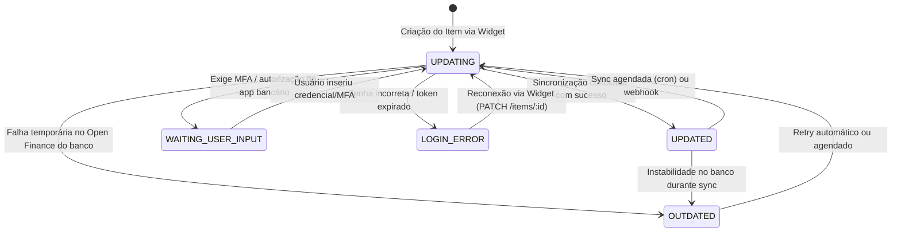

# Research: Integração Open Finance com Pluggy (R1)

> **Data da pesquisa**: 05 de outubro de 2026  
> **Autor**: Gemini (Deep Research)  
> **Alimenta as features**: `007 · conexao-open-finance`, `008 · sync-automatica`, `011 · deduplicacao`, `018 · faturas-cartao`  
> **Formato de entrega**: Conforme padronizado em `docs/gemini-handoff.md`

---

## 1. Resumo (5 linhas)

A Pluggy disponibiliza o portal **"Meu Pluggy"**, que permite a desenvolvedores consumir seus próprios dados financeiros via API de forma gratuita com limite de até **5 conexões ativas**.
As 4 instituições do perfil do Doug (**Caixa, C6 Bank, Mercado Pago e PicPay**) possuem conectores ativos na plataforma com suporte a contas correntes, cartões de crédito e investimentos básicos.
A integração frontend em Next.js é feita com o pacote `react-pluggy-connect`, alimentado por um `connect_token` efêmero (30 min) gerado no backend sem expor segredos.
O ciclo de vida do Item transita entre `UPDATING`, `UPDATED`, `WAITING_USER_INPUT`, `LOGIN_ERROR` e `OUTDATED`, com consentimento Open Finance sem expiração padrão (`expiresAt: null`).
A coleta inicial recupera até **12 meses** de transações, as atualizações rotineiras trazem os últimos **7 dias**, e notificações ocorrem via webhooks assinados.

---

## 2. Achados Detalhados

### 2.1 Modelo "Meu Pluggy" vs. API Comercial e Custos

| Critério | "Meu Pluggy" (Uso Pessoal / Desenvolvedor) | Planos Comerciais Pluggy |
|---|---|---|
| **Público-alvo** | Uso próprio / desenvolvedor pessoal / automação individual. | Fintechs, apps B2C com múltiplos usuários, empresas. |
| **Custo** | **R$ 0 / mês** (gratuito). | A partir de **R$ 2.500 / mês**. |
| **Limite de Conexões** | Até **5 conexões ativas** por titular/CPF. | Escalável por contrato / volume. |
| **Acesso à API** | Completo para as contas conectadas (endpoints `/accounts`, `/transactions`, `/investments`). | Completo + recursos de KYC/PIX avançados. |
| **SLA & Suporte** | Comunitário / sem SLA formal. | SLA empresarial dedicado. |
| **Enquadramento no Prumo** | **Perfeito para a Constitution e ADR 0006**: Doug utiliza exatamente 4 instituições (Caixa, C6, Mercado Pago, PicPay), mantendo o custo em **R$ 0/mês**. | Desnecessário para app single-user pessoal. |

### 2.2 Ambiente de Sandbox

- **Conector de Teste**: A Pluggy fornece um conector de Sandbox (ID `0` ou `2`) que simula instituições financeiras sem tocar em bancos reais.
- **Credenciais Mapeadas**:
  - `user-ok` / `password-ok` (MFA `123456`) $\rightarrow$ simula conexão bem-sucedida (`UPDATED`).
  - Outros usuários simulam cenários de erro: `user-credentials-error` $\rightarrow$ `LOGIN_ERROR`; `user-needs-action` $\rightarrow$ `WAITING_USER_INPUT`.
- **Dinâmica dos Dados**: Dados de transações em Sandbox sofrem refresh semanal. Itens inativos há mais de 30 dias são excluídos automaticamente pela Pluggy.
- **Uso em CI**: Conforme Constitution V, o CI não deve chamar a API externa da Pluggy. Testes de integração utilizam fixtures baseadas nos contratos OpenAPI da Pluggy.

### 2.3 Cobertura dos Conectores do Perfil do Doug

| Instituição | Conector Pluggy | Contas Suportadas | Cartão de Crédito / Faturas | Investimentos |
|---|---|---|---|---|
| **Caixa Econômica Federal** | `Caixa` / `Caixa Tem` | Conta corrente, poupança, Caixa Tem. | Sim (faturas e lançamentos). | Aplicações básicas / poupança. |
| **C6 Bank** | `C6 Bank` (PF) | Conta corrente. | Sim (faturas abertas/fechadas, lançamentos, limites). | CDBs e fundos C6. |
| **Mercado Pago** | `Mercado Pago` (PF) | Conta digital / carteira. | Cartão de crédito Mercado Pago. | Saldo remunerado. |
| **PicPay** | `PicPay` (PF) | Carteira digital / conta corrente. | Cartão PicPay Card. | Cofrinhos / Caixinhas (mapeados como CDBs). |

*Nota de estabilidade*: Conectores de bancos tradicionais (como Caixa) sofrem com maior frequência de janelas de manutenção de Open Finance aos finais de semana, exigindo tratamento adequado do estado `OUTDATED`.

### 2.4 Arquitetura do Widget Pluggy Connect em Next.js

Para respeitar a **Constitution II (Segredos apenas no servidor)**:

```text
[Navegador / React]              [Next.js Server API]              [Pluggy API]
        |                                 |                             |
        |--- 1. POST /api/pluggy/token -->|                             |
        |                                 |--- 2. Autentica com ------->|
        |                                 |    CLIENT_ID / SECRET       |
        |                                 |<-- 3. Retorna access token -|
        |                                 |                             |
        |                                 |--- 4. POST /connect_token ->|
        |                                 |<-- 5. connectToken (30 min)-|
        |<-- 6. { connectToken } ---------|                             |
        |                                                               |
        |--- 7. Monta <PluggyConnect connectToken={...} /> ------------>|
        |       (abre modal / iframe seguro do Open Finance)           |
        |                                                               |
        |<-- 8. onSuccess({ item }) / onError({ error }) ---------------|
        |                                 |                             |
        |--- 9. Notifica backend -------->|                             |
```

- **Frontend**: Utiliza a biblioteca oficial `react-pluggy-connect`.
- **Token**: O `connectToken` tem validade de **30 minutos** e escopo estritamente limitado à sessão do widget.
- **Modo Reconexão / Atualização**: Ao precisar atualizar credenciais de um item já existente, passa-se o `itemId` na criação do `connectToken` (`POST /connect_token { itemId: "..." }`). Isso evita duplicar itens no banco do Prumo.

### 2.5 Ciclo de Vida do Item e Máquina de Estados

Um `Item` representa a conexão com uma instituição financeira:



- **`UPDATING`**: Coleta de contas, faturas e transações em progresso.
- **`UPDATED`**: Conexão saudável; dados prontos para ingestão.
- **`WAITING_USER_INPUT`**: Exige intervenção do usuário (ex.: autenticação biométrica ou token SMS).
- **`LOGIN_ERROR`**: Conexão quebrada por alteração de senha ou expiração de chave. Requer abertura do widget em modo de reconexão.
- **`OUTDATED`**: Instabilidade temporária de rede ou indisponibilidade da instituição. Não requer nova senha de imediato; resolve-se com retentativa (backoff exponencial).

### 2.6 Consentimento e Expiração no Open Finance

- **Validade do Consentimento**: Por padrão na Pluggy, os consentimentos de Open Finance são solicitados sem data limite de expiração (`expiresAt: null`).
- **Exceções**: Certas instituições impõem teto regulatório de 12 meses.
- **Revogação**: O usuário pode revogar o acesso a qualquer momento pelo aplicativo do seu próprio banco. Nesse caso, a Pluggy passa a reportar erro de autorização.
- **Renovação**: É realizada chamando `PATCH /items/:id` e abrindo o widget com o mesmo `itemId`, preservando as chaves estrangeiras já associadas no banco do Prumo.

### 2.7 Webhooks e Sincronização Automática

- **Eventos Principais**:
  - `item/created`: Item recém-conectado.
  - `item/updated`: Sincronização de contas/saldos finalizada com sucesso.
  - `item/error`: Item falhou durante a atualização (transição para `LOGIN_ERROR` ou `OUTDATED`).
  - `item/deleted`: Conexão removida pelo usuário.
  - `transactions/created`: Novos lançamentos capturados.
- **Segurança e Validação de Assinatura**:
  - A Pluggy permite cadastrar cabeçalhos HTTP customizados no momento do registro do webhook (ex.: `x-webhook-secret: <segredo>`).
  - O endpoint no Next.js (`/api/webhooks/pluggy`) deve validar obrigatoriamente esse header em tempo constante (`crypto.timingSafeEqual`) antes de processar qualquer payload.
- **Janela de Transações**:
  - **Sync Inicial**: A Pluggy busca até **12 meses** de histórico de movimentações na primeira sincronização.
  - **Syncs Rotineiras**: Puxam os últimos **7 dias** para capturar lançamentos compensados e ajustes de saldo.
  - **Limite para Histórico Retroativo**: O Open Finance regulatório restringe consultas retroativas profundas (> 7 dias) a no máximo **4 chamadas por mês por CPF/instituição**.

---

## 3. Limitações e Riscos

1. **Limite de 5 Conexões no Plano Gratuito**: O Doug utiliza 4 conexões hoje (Caixa, C6, Mercado Pago e PicPay). Se futuramente adicionar uma 5ª instituição, atingirá o limite máximo do modelo gratuito.
2. **Volatilidade de APIs Bancárias**: Instituições bancárias (principalmente estatais como a Caixa) passam por janelas frequentes de indisponibilidade de Open Finance. O sistema do Prumo não pode entrar em pânico nem apagar dados quando um conector entrar em `OUTDATED`.
3. **MFA e Intervenções Periódicas**: Algumas instituições exigem reconfirmação de token pelo aplicativo a cada poucas semanas. A Feature 008 (Sync Automática) deve detectar `WAITING_USER_INPUT` e alertar o usuário sem travar os jobs em segundo plano.
4. **Duplicação com Importação Manual**: Como o Doug também fará importação de arquivos (PDF de fatura do C6 e extratos OFX), a Feature 011 (Deduplicação) precisará correlacionar o `external_id` da Pluggy com data, valor exato e descrição das importações manuais para evitar duplicar entradas.

---

## 4. Recomendações Técnicas para as Specs 007 e 008

1. **Conta e Chaves da Pluggy**:
   - Criar a conta de desenvolvedor gratuita no portal [pluggy.ai](https://pluggy.ai/) e habilitar o "Meu Pluggy".
   - Armazenar `PLUGGY_CLIENT_ID` e `PLUGGY_CLIENT_SECRET` estritamente nas variáveis de ambiente do servidor Vercel (Production) e no `.env.local` de desenvolvimento.
2. **Isolamento de Segredos e API Route**:
   - Criar rota `src/app/api/pluggy/token/route.ts` que valida a sessão do usuário (Feature 006) e emite o `connectToken` com TTL de 30 minutos.
3. **Persistência de Conexões**:
   - Modelar no banco a tabela `connections` (Feature 004/007) gravando:
     - `pluggy_item_id` (UUID único).
     - `institution_id` e `institution_name`.
     - `status` (`UPDATING`, `UPDATED`, `WAITING_USER_INPUT`, `LOGIN_ERROR`, `OUTDATED`).
     - `last_sync_at` (TIMESTAMPTZ UTC).
     - `consent_expires_at` (TIMESTAMPTZ UTC, nullable).
4. **Idempotência de Transações (Constitution IV)**:
   - Gravar cada transação oriunda da Pluggy com `source = 'pluggy'` e `external_id = item.transaction.id`.
   - Adicionar constraint de unicidade `UNIQUE(source, external_id)` para garantir que re-sincronizações nunca dupliquem lançamentos.
5. **Estratégia de Sincronização Dupla**:
   - **Webhooks**: Para ingestão reativa em tempo quase real quando a Pluggy emitir `item/updated`.
   - **Cron de Fallback**: Um job agendado via Supabase Cron / GitHub Actions diário para disparar `POST /items/:id/sync` caso algum evento de webhook seja perdido.

---

## 5. Fontes Consultadas

1. **Pluggy Documentation — Connectors Coverage & Institutions**:  
   [https://docs.pluggy.ai/docs/connectors](https://docs.pluggy.ai/docs/connectors) — Acessado em 05/10/2026.
2. **Pluggy Documentation — Pluggy Connect & Next.js Integration**:  
   [https://docs.pluggy.ai/docs/pluggy-connect](https://docs.pluggy.ai/docs/pluggy-connect) — Acessado em 05/10/2026.
3. **Pluggy Documentation — Item Lifecycle & Execution Statuses**:  
   [https://docs.pluggy.ai/docs/item-lifecycle](https://docs.pluggy.ai/docs/item-lifecycle) — Acessado em 05/10/2026.
4. **Pluggy Documentation — Webhooks Configuration & Security**:  
   [https://docs.pluggy.ai/docs/webhooks](https://docs.pluggy.ai/docs/webhooks) — Acessado em 05/10/2026.
5. **Pluggy Documentation — Sandbox Environment & Mock Credentials**:  
   [https://docs.pluggy.ai/docs/sandbox](https://docs.pluggy.ai/docs/sandbox) — Acessado em 05/10/2026.
6. **Meu Pluggy — Portal Pessoal Open Finance**:  
   [https://meu.pluggy.ai/](https://meu.pluggy.ai/) — Acessado em 05/10/2026.

